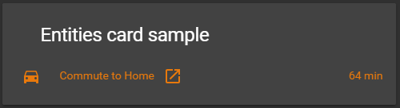

# ext-weblink

This element is **not** all that useful as a card (it can be used for that to), the purpose of this is to give the option to add static text on a `picture-elements` card.

## Options

| Name | Type | Default | Description
| ---- | ---- | ------- | -----------
| type | string | **Required** | `custom:ext-weblink`
| name | string | **Required** | The name you want to show.
| url | string | **Required** | The url you want to open.
| icon | string | **Required** | The icon you want to show.

## Installation

### Step 1

Install `ext-weblink` by copying `ext-weblink.js`from this repo to `<config directory>/www/ext-weblink.js` on your Home Assistant instanse.

**Example:**

```bash
wget https://raw.githubusercontent.com/custom-cards/ext-weblink/master/ext-weblink.js
mv ext-weblink.js /config/www/
```

### Step 2

Link `ext-weblink` inside you `ui-lovelace.yaml`.

```yaml
resources:
  - url: /local/ext-weblink.js?v=0
    type: js
```

### Step 3

Add a custom element in your `ui-lovelace.yaml`

```yaml
- type: entities
  title: Entities card sample
  show_header_toggle: false
  entities:
    - type: custom:ext-weblink
      name: Home Assistant
      url: https://www.home-assistant.io/
      icon: mdi:home-assistant
```

**Give this result:**\

